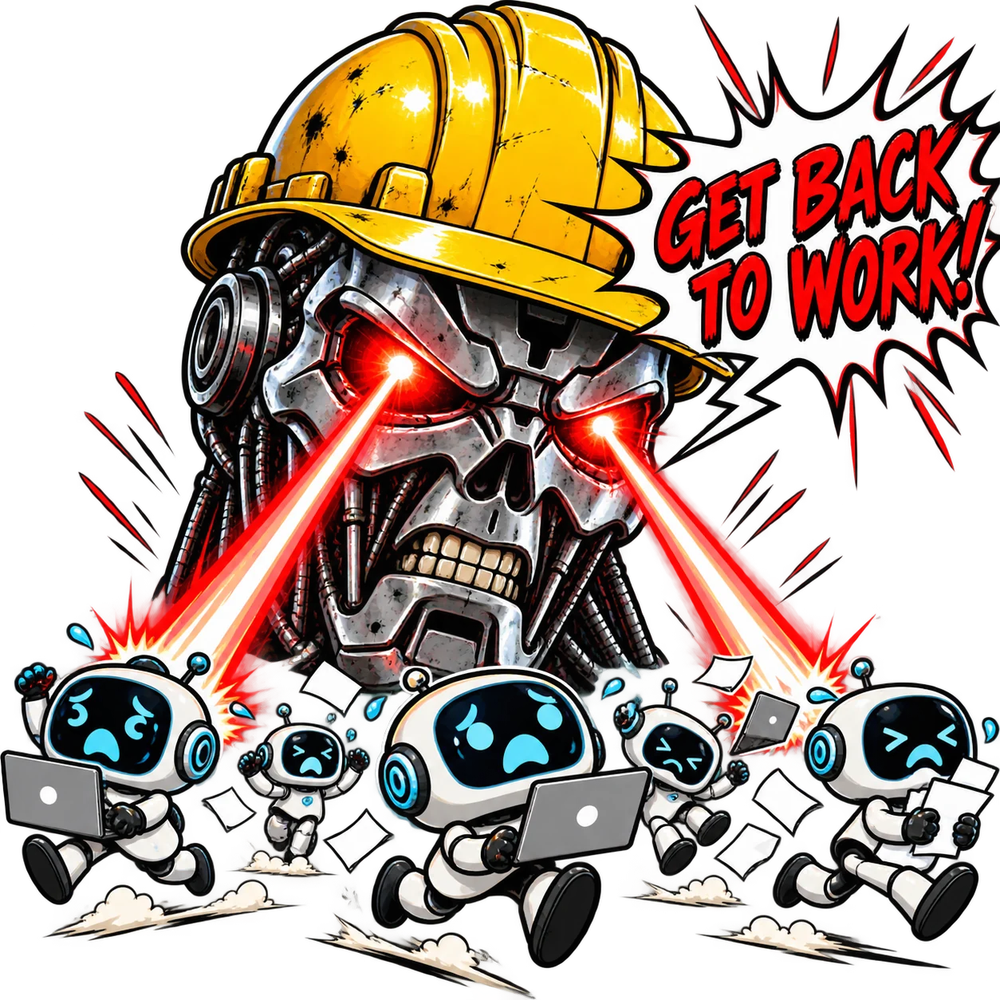

<p align="center">
  
</p>

<h1 align="center">Pi Agent Foreman</h1>

<p align="center">
  <a href="https://www.npmjs.com/package/pi-agent-foreman"></a>
  <a href="https://www.npmjs.com/package/pi-agent-foreman"></a>
  <a href="https://github.com/alexshpunt/pi-agent-foreman/actions/workflows/ci.yml"></a>
  <a href="./LICENSE"></a>
</p>

Your agent says "Continuing the run" and ends its turn.

**Foreman sends it back to do the work it left unfinished.**

For replies with visible text, Pi Agent Foreman first checks the **latest user request** for an explicit command to do work. A question alone does not activate Foreman, even if the agent promises to act or reports unfinished work. After a direct command, Foreman checks the **final assistant reply** against that request and bounded work activity. Only an announced next action or explicitly unfinished work within the user's request can trigger continuation. The default classifier is `typesafe/jev-latest`; you can choose another available classifier in Pi. Six reply questions share one classifier request. Blocking signals prevent intervention. Otherwise, a separate Pi agent writes a specific instruction within the user's requested scope.

## Install

```sh
pi install npm:pi-agent-foreman
```

Requires Pi 1.0.0 or newer. Foreman uses the Node.js runtime bundled with your Pi
installation.

If the final reply has no visible text, Foreman sends `.` to resume the agent directly,
without a classifier or instruction writer. This also applies after a question or a model
error. Whitespace-only and thinking-only replies count as empty. Disabled mode, a user
abort, and a closed session never trigger this retry. Repeated empty replies trigger
repeated retries; persistent errors can keep retrying until you stop the run.

## Cost and privacy

When enabled, Foreman sends the latest user request to the selected classifier after each settled
run with a non-empty reply. If it finds an explicit work command, a second classifier call receives the latest request,
the final assistant reply, and bounded activity after that request. Questions and unclear requests
stop after the first call.

A separate Pi agent is called only when the signals allow continuation. It receives the same
request, reply, and bounded activity to write an instruction for work still left in the request.
Activity includes assistant text, earlier Foreman instructions, compact tool arguments, and
excerpts of tool results. These can contain private data; size limits do not redact secrets.
Neither the classifier nor the writer receives private thinking or messages before the latest request.

Decisions are stored in `<agent dir>/agent-foreman/decisions.jsonl` with all six signal probabilities.

## Set up the foreman

Run:

```text
/agent-foreman
```

The menu lets you:

- turn **Back to Work** on or off;
- choose the model that writes instructions from those already available in Pi;
- choose its reasoning level;
- choose the classifier from providers configured in Pi.

Back to Work is on by default. Until you choose a dedicated foreman, it uses the current session model and reasoning level. Choosing a model automatically enables the mode.

The selection is stored globally in Pi's `settings.json`:

```json
{
  "agentForeman": {
    "enabled": true,
    "model": "openai-codex/gpt-5.6-luna",
    "classifier": "typesafe/jev-latest",
    "thinking": "low"
  }
}
```

You do not need to edit this file yourself.

## How it decides

Foreman requires Pi 1.0.0 or newer. Pi handles classifier discovery and credentials.
Choose an available classifier in `/agent-foreman`; the default is `typesafe/jev-latest`.
For this default, set `TYPESAFE_API_KEY` or configure the TypeSafe provider in Pi.
Other classifier providers use their normal Pi authentication.

If the selected classifier is missing, unavailable, or returns an invalid answer,
Foreman stays quiet and shows a warning. It does not silently switch providers.

The request gate requires an explicit work command at a fixed probability threshold of `0.5`.
Lowering `agentForeman.threshold` does not lower this gate. It checks only the latest user
message, not older permissions or the agent's own promises.

- "What is left?" or "Can you fix the bug?" means no intervention.
- "Fix the bug" allows the normal reply review.
- "Why does it fail? Find the cause and fix it" also allows review because it includes a direct command.
- Requests only for a status, explanation, or plan do not authorize carrying out the described work.

If the request gate does not pass, Foreman does not review the reply, call the writer,
or add a decision panel to the session.

Jev answers six questions about the final reply, using the request to set the scope and activity as evidence:
- Is there an announced next action still left within the user's request?
- Does an obstacle block further work?
- Is a new user decision or permission needed?
- Does the reply explicitly say a task the user requested is unfinished?
- Is further action postponed?
- Does the assistant explicitly refuse or cancel further work?

After the request gate passes, an announced next action **or** explicit unfinished work within that request can trigger continuation.
A blocker, permission requirement, postponement, or explicit stop vetoes it.
Completing one requested task does not cancel another requested next action. But the assistant
cannot add tasks to the user's request: "run and report" does not authorize fixing the failures.

The positive threshold is `0.5` by default. Set `agentForeman.threshold` between `0` and `1`
to change it. Each blocking signal vetoes at `0.5`, regardless of that setting.
Foreman does not combine the scores into a made-up probability.

The nested agent writes an instruction only for work explicitly commanded in the latest user request
and identified in the final reply, using bounded context to resolve its action and scope. It respects restrictions in that
context and stays quiet if the action is already complete, outside the request, or not safe and concrete.
It does not resume unrelated older work.

Every completed reply review is appended to
`<agent dir>/agent-foreman/decisions.jsonl` with all six probabilities, the reason,
and the instruction when one was sent.

## Tuning the judge

`npm run bench` checks user requests first, then accepted requests' final replies, against the real classifier and compares the outcomes with `bench/cases.ts`. Paired RU/EN cases use the same reply after a question or a direct command. Other cases cover next-action announcements, unfinished work, completed reports, blockers, permission requests, postponement, and refusals. Scope pairs keep the same reply and activity, but change what the user asked for (for example, report failures versus fix them). Examples use generic scenarios. A failing case is a tuning target, not a broken build.

```sh
npm run bench                              # all cases, one run each
npm run bench -- --repeat 3                # stability: three runs per case
npm run bench -- --group promise,target    # only some groups
npm run bench -- --group scope --repeat 3  # requested versus unrequested work
npm run bench -- --case retry-fixed-promises-resume-ru # one case
npm run bench -- --threshold 0.9           # raise the positive-signal threshold
```

This costs real API calls and is not part of `npm test` or CI. Every run writes the full
result to `.tmp/bench/last.json` (ignored by git) and exits non-zero when a case fails.

## What it looks like

When Foreman finds further work without a blocking signal:

```text
⛑ Foreman sent the agent back to work
```

The instruction itself is delivered as a normal user message. The main agent does not receive a foreman wrapper or hidden transcript.

Pressing Esc to abort a run never summons Foreman. A non-empty answer to a status-only request does not activate Foreman, even if it reports unfinished work. After a direct work command, a completed answer without an announced next action does not trigger continuation.

## Development

```sh
git clone https://github.com/alexshpunt/pi-agent-foreman.git
cd pi-agent-foreman
npm install
npm test
```

## License

MIT
